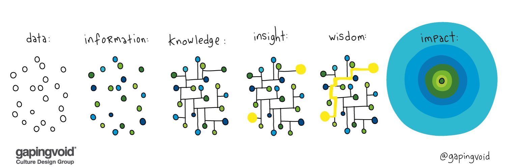
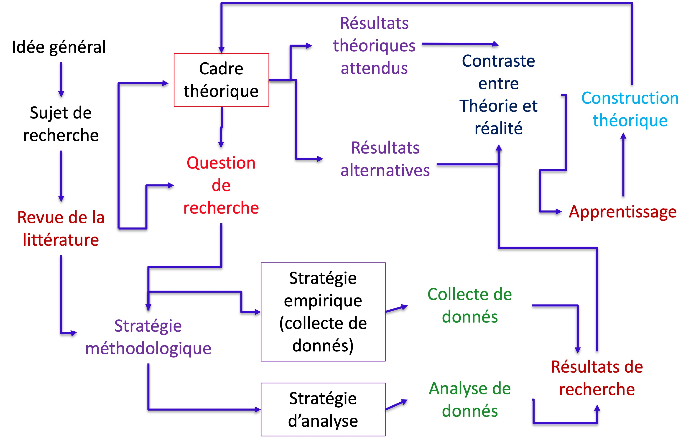
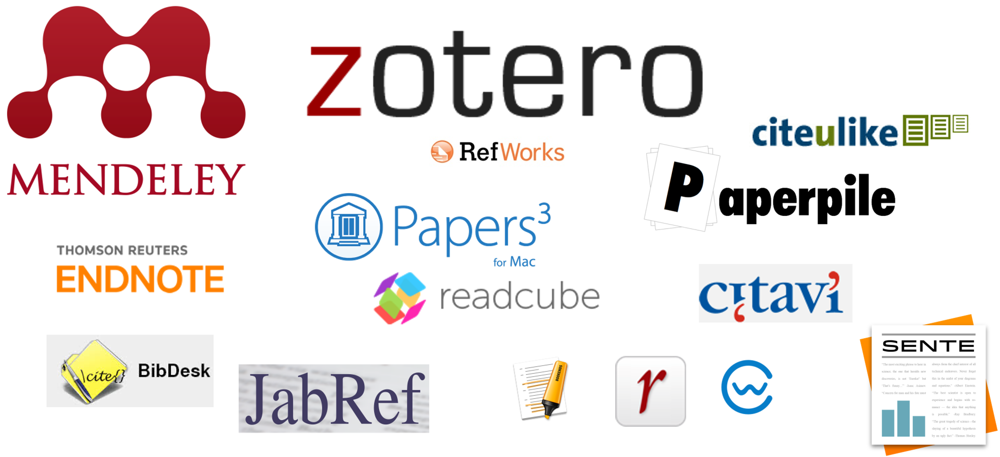
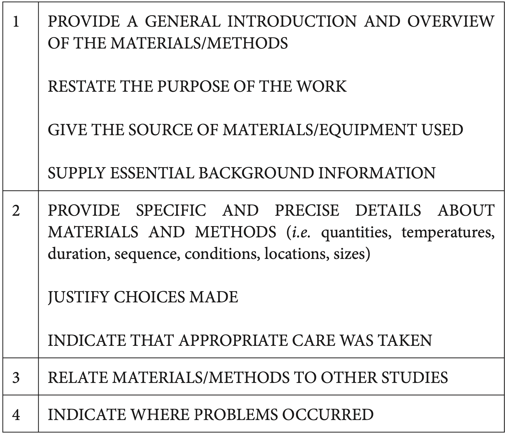
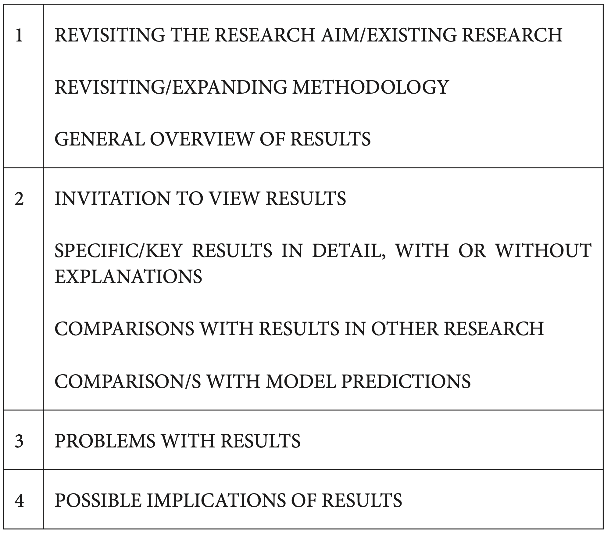
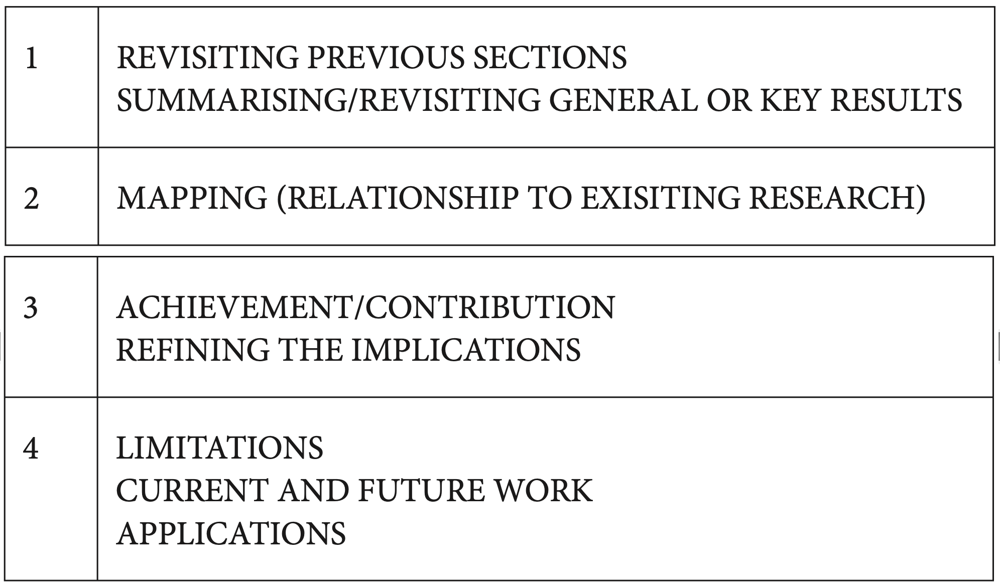

```{r setup, include=FALSE}
options(htmltools.dir.version = FALSE)
knitr::opts_chunk$set(
  fig.width=9, fig.height=3.5, fig.retina=3,
  out.width = "100%",
  cache = FALSE,
  echo = FALSE,
  message = FALSE, 
  warning = FALSE,
  hiline = TRUE
)

library(countdown)

xaringanExtra::use_xaringan_extra(c("tile_view", "animate_css", "tachyons", "share_again"))


```


# Objectives

1. Structuration d'un document scientifique

2. Des outils


---

# Dans la dernière séance


---

```{r, out.width='100%', fig.align='center'}

```

.footnote[Credit Source: https://twitter.com/gapingvoid]

---

## Le processus de Recherche scientifique

```{r, out.width='80%', fig.align='center'}

```


---

class: inverse middle

# Comment lire un article scientifique?


---

class: top, left
background-image: url("figures/Paper-Alex-01.jpg")
background-position: 100% 70%
background-size: 55%


# Document Scientifique


.pull-left[

- .bg-yellow[Titre]
- .bg-yellow[Résumé]
- .bg-yellow[Introduction]
- Literature review
- Methodologie
- Resultats
- Discussion
- .bg-yellow[Conclusion]
- References


**Méthode AIC**

]

---


## Méthode AIC - Abstract / Introduction / Conclusion

<br>
Screening -> .bg-yellow[**Titre, Journaux, Mots Clés and Résumé**] 

Synthese detaillé  use **AIC**
<br>
<br>

### .bg-green[Abstract → Résumé du document]

### Introduction → Contexte du problème et de la recherche, lacunes, résumé de ce qui est fait.

### Conclusions → Résumé des résultats et importance des résultats compte tenu du contexte.


---

class: inverse middle

.white[

# Analyse du Résumé

>Le produit minimal viable d'une recherche.

]

---

class: top, left
background-image: url("figures/niang2022.png")
background-position: 100% 5%
background-size: 65%

## Exemple 1


.footnote[
Source: Niang, A., Bourdin, S., Torre, A., 2022. Vers une territorialisation des dynamiques de l’économie circulaire ? Analyse du cas français, 2008-2015. Revue d’économie industrielle 177, 67–101. https://doi.org/10.4000/rei.11225
]


---


class: top, left
background-image: url("figures/niang2022a.jpg")
background-position: 100% 5%
background-size: 65%

## Exemple 1

.pull-left-1.small[

Quel est le sujet ?

Quel est le problème ?
(Est-il important ?)

Quelle est la question de recherche ?

Quel est l'objectif ?

Comment ils ont fait ?

Implications pour l'avenir?


.footnote[
Source: Niang, A., Bourdin, S., Torre, A., 2022. Vers une territorialisation des dynamiques de l’économie circulaire ? Analyse du cas français, 2008-2015. Revue d’économie industrielle 177, 67–101. https://doi.org/10.4000/rei.11225
]

]

---

class: top, left
background-image: url("figures/forget2021.png")
background-position: 100% 5%
background-size: 70%

## Exemple 2


.pull-left-1.small[


.footnote[
Source: Forget, M., Bos, V., Carrizo, S.C., 2021. De nouveaux territoires énergétiques dans les Andes et Alpes. Sur les sentiers des transitions. Espaces et sociétés 182, 15–32. https://doi.org/10.3917/esp.182.0015
]

]

---

class: top, left
background-image: url("figures/forget2021.jpg")
background-position: 100% 5%
background-size: 70%

## Exemple 2


.pull-left-1.small[


Quel est le sujet ?

Quel est le problème ?
(Est-il important ?)

Quelle est la question de recherche ?

Quel est l'objectif ?

Comment ils ont fait ?

Implications pour l'avenir?


.footnote[
Source: Forget, M., Bos, V., Carrizo, S.C., 2021. De nouveaux territoires énergétiques dans les Andes et Alpes. Sur les sentiers des transitions. Espaces et sociétés 182, 15–32. https://doi.org/10.3917/esp.182.0015
]

]

---

class: top, left
background-image: url("figures/kasmi2017.png")
background-position: 80% 0%
background-size: 38%

## Exemple 3


.pull-left-1.small[


.footnote[
Source: [Kasmi, F., Laperche, B., Burmeister, A., Merlin-Brogniart, C., 2017. Ecologie industrielle, milieu innovateur et gouvernance territoriale, revue canadienne des sciences régionales 40 (2), 103-113. The Canadian journal of regional science = La revue canadienne des sciences régionales](https://idjs.ca/images/rcsr/archives/V40N2-KASMI-LAPERCHE.pdf).

]

]


---

class: top, left
background-image: url("figures/kasmi2017a.png")
background-position: 80% 0%
background-size: 38%

## Exemple 3


.pull-left-1.small[

Quel est le sujet ?

Quel est le problème ?
(Est-il important ?)

Quelle est la question de recherche ?

Quel est l'objectif ?

Comment ils ont fait ?

Implications pour l'avenir?


.footnote[
Source: [Kasmi, F., Laperche, B., Burmeister, A., Merlin-Brogniart, C., 2017. Ecologie industrielle, milieu innovateur et gouvernance territoriale, revue canadienne des sciences régionales 40 (2), 103-113. The Canadian journal of regional science = La revue canadienne des sciences régionales](https://idjs.ca/images/rcsr/archives/V40N2-KASMI-LAPERCHE.pdf).

]

]

---

## Modele mental

.small[
1. .blue[Sujet] → l'auteur fournit des informations factuelles de base.

1. .blue[Problème] → l'auteur présente la lacune/le problème à traiter.

1. .blue[Lacune de la recherche] → l'auteur énonce les limites des connaissances actuelles.

1. .blue[Le but] → l'auteur présente l'objectif général et l'objectif spécifique de l'étude.

1. .blue[La méthodologie] → l'auteur résume la méthodologie et fournit des détails.

1. .blue[Les résultats] → l'auteur indique les résultats de l'étude.
1. .blue[Les perspectives] → l'auteur présente les implications de l'étude.
]

---

class: inverse 

# Exercise 1:  à votre tour de jouer sur les Résumés!

Zotero + Trois Résumés


```{r echo=FALSE}
countdown(minutes = 45, font_size = "3em", color_background="#AED6F1", left='0px')
```

.bg-white[
Telechargez le TD: https://github.com/fabbiocrux/Eduter/raw/master/TD/TD2-Eduter.docx
]

---

# Gestion de References Bibliographiques
## Mendeley, Zotero

- Vous permet d'organiser, de collaborer, de découvrir et de citer tout en écrivant. 

.pull-left[

Tutoriel sur Zotero:

[ENT > Biblioteque UL](https://bu.univ-lorraine.fr/aide-a-la-recherche-documentaire)

]

.pull-right[
```{r, out.width='100%'}

```

]


---


class: inverse middle

# Méthode AIC - Abstract / Introduction / Conclusion


---

## Méthode AIC - Abstract / Introduction / Conclusion

<br>
☑ Screening -> Titre, Journaux, Mots Clés and Résumé

.bg-yellow[Synthese detaillé  use **AIC**]
<br>️
<br>

### Abstract → Résumé du document

### Introduction → Contexte du problème et de la recherche, lacunes, résumé de ce qui est fait.

### Conclusions → Résumé des résultats et importance des résultats compte tenu du contexte.


---


class: top, left
background-image: url("figures/niang2022.png")
background-position: 100% 5%
background-size: 65%

## Exemple 1


Lire

1. Introduction
2. Conclusion


.footnote[
Source: Niang, A., Bourdin, S., Torre, A., 2022. Vers une territorialisation des dynamiques de l’économie circulaire ? Analyse du cas français, 2008-2015. Revue d’économie industrielle 177, 67–101. https://doi.org/10.4000/rei.11225
]


```{r echo=FALSE}
countdown(minutes = 15, font_size = "3em", color_background="#AED6F1", left='0px')
```


---


## Reading technique

<br>

### [1min] .bg-grey[Screening] → Title, Journal, keywords

### [5min] .bg-yellow[Profiling] → .bg-grey[Screening] + Abstract

### [20min] .bg-orange.white[Focusing] → .bg-yellow[Profiling] + Introduction + Conclusions

### [1hr] .bg-green[In deep] → .bg-orange.white[Focusing] + All other sections

### [2-3 hr] For research → .bg-green[In deep] + Reading Grid + References


---

class: inverse middle

# Exercise 2:  Lecture d'un article de vos 3 et tableau 2!

Zotero + Trois Résumés


```{r echo=FALSE}
countdown(minutes = 45, font_size = "3em", color_background="#AED6F1", left='0px')
```


---
class: inverse middle

# Structurer un Doc Scientifique

---

class: top, left
background-image: url("figures/montagnes2022-1.jpg")
background-position: 50% 70%
background-size: 80%

## Structurer un Doc Scientifique

.footnote[Source: 1. Montagnes, D. J. S., Montagnes, E. I. & Yang, Z. Finding your scientific story by writing backwards. Mar Life Sci Technol 4, 1–9 (2022).]

---


class: top, left
background-image: url("figures/montagnes2022.jpg")
background-position: 50% 70%
background-size: 80%

## Structurer un Doc Scientifique


.footnote[Source: 1. Montagnes, D. J. S., Montagnes, E. I. & Yang, Z. Finding your scientific story by writing backwards. Mar Life Sci Technol 4, 1–9 (2022).]


---

class: top, left
background-image: url("figures/Structuration-abstract.png")
background-position: 100% 50%
background-size: 30%


## Structurer un Doc Scientifique


.footnote[Source: 1. Montagnes, D. J. S., Montagnes, E. I. & Yang, Z. Finding your scientific story by writing backwards. Mar Life Sci Technol 4, 1–9 (2022).]


---
class: top, left
background-image: url("figures/Structuration-introduction.png")
background-position: 100% 50%
background-size: 30%


## Structurer un Doc Scientifique
### Introduction


- Il doit établir l’importance du sujet de recherche 

- établir un lien avec la littérature existante 

- établir clairement le “Gap to be filled”

- Expliquer comment on a traité le sujet 

- “Annoncer la couleur” des résultats
- Enfin : Décrire la structure de l’article 

---

class: top, left
background-image: url("figures/Structuration-methodology.png")
background-position: 100% 50%
background-size: 30%


## Structurer un Doc Scientifique
### Methodologie


.pull-left-2[

```{r, out.width='80%', fig.align='left'}

```
]

---


class: top, left
background-image: url("figures/Structuration-results.png")
background-position: 100% 50%
background-size: 30%


## Structurer un Doc Scientifique
### Results

.pull-left-2[

```{r, out.width='80%', fig.align='left'}

```
]


---


class: top, left
background-image: url("figures/Structuration-discussion.png")
background-position: 100% 50%
background-size: 30%


## Structurer un Doc Scientifique
### Discussion & Conclusions

.pull-left-2[

```{r, out.width='90%', fig.align='left'}

```
]


---

class: inverse middle

# Exercise 3:  Ecriture d'un  Résumé!


```{r echo=FALSE}
countdown(minutes = 45, font_size = "3em", color_background="#AED6F1", left='0px')
```

---


---
# Les outils de la veille

## .bg-green.blue[Flux RSS]

.pull-left[

Le flux RSS (Really Simple Syndication) est un format de syndication de contenu,outil du Web, qui permet de s’informer des dernières mises à jour d’une base dedonnées, d’une page web, d’un site, sans les consulter directement

]
.pull-rigth[


Inoreader
]